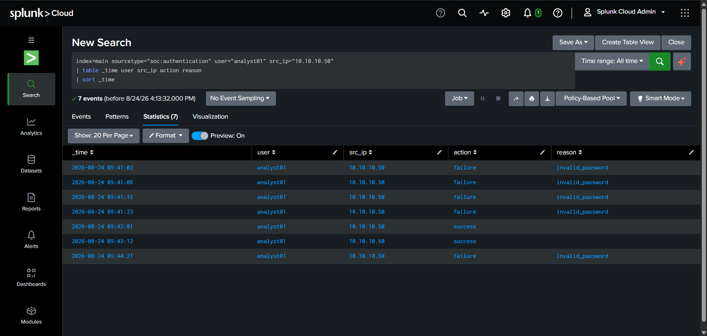
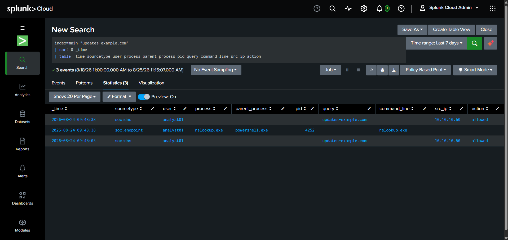
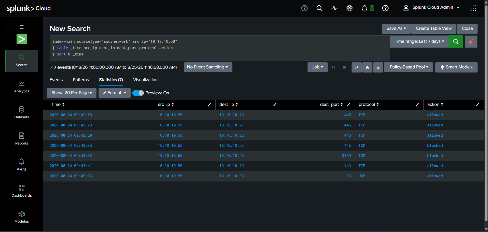
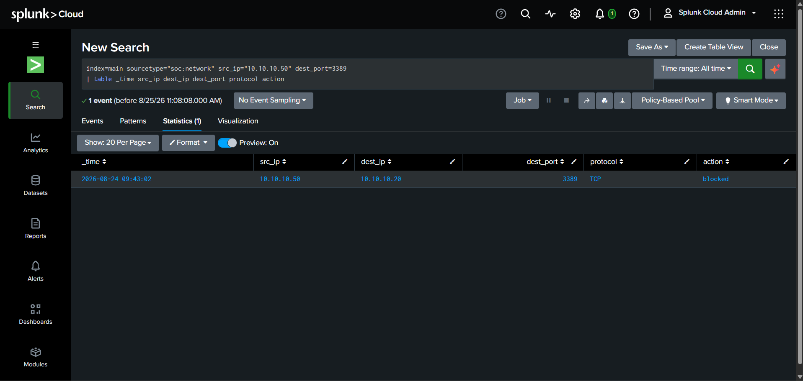
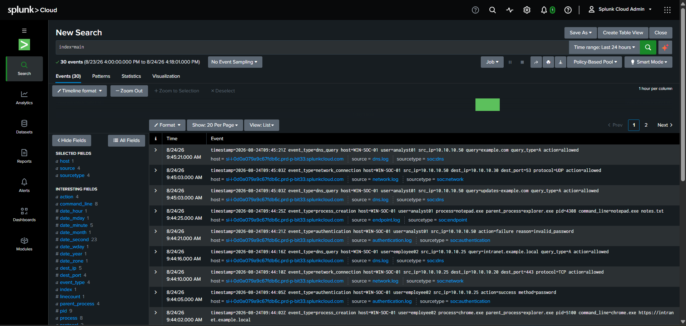

# SOC Alert Triage & Incident Investigation Lab

A hands-on SOC investigation built entirely in Splunk Cloud using synthetic security telemetry — authentication, endpoint, DNS, and network logs correlated into a single incident timeline, then converted into a working SPL detection.

## Project Overview

Most beginner SOC projects stop at "here's a suspicious event." This one goes further: it starts from a single alert, walks through four separate telemetry sources to build evidence, correlates that evidence into a timeline, extracts IOCs, maps the observed behavior to MITRE ATT&CK, and ends with a tested detection rule and a formal incident report — the same workflow a Tier 1 analyst actually follows.

The dataset is synthetic and self-authored, built to be internally consistent (matching timestamps, PIDs, users, and IPs across sources) rather than pulled from a public dataset — the investigation logic is the point, not the data source.

## Scenario

An alert fires for host `WIN-SOC-01`, user `analyst01`. The raw sequence looks like this:

```
Multiple failed logins  ->  Successful login  ->  Endpoint discovery commands
     ->  PowerShell execution  ->  DNS lookup  ->  Internal SMB connections  ->  Blocked RDP attempt
```

The question driving the investigation: is this five unrelated events, or one incident?

## Tools & Technologies

- **Splunk Cloud** — ingestion, SPL search, detection logic
- **SPL (Search Processing Language)** — investigation queries and final detection rule
- Synthetic telemetry across 4 sourcetypes: authentication, endpoint, DNS, network

## Investigation Workflow

```
Authentication triage -> Endpoint investigation -> Process correlation
     -> DNS correlation -> Network investigation -> IOC extraction
     -> MITRE mapping -> Detection development -> Incident assessment
```

**Authentication triage** — isolated failed vs. successful logins for `analyst01`, checked whether the successful login came from the same source as the failures.

**Endpoint investigation** — pulled process creation events for `WIN-SOC-01`, identified the process chain and which processes spawned which.

**Process correlation** — traced `nslookup.exe` (PID 4252) back to its parent, `powershell.exe` (PID 4216).

**DNS correlation** — matched the domain queried by `nslookup.exe` against independent DNS telemetry for the same host/user, confirming it wasn't a coincidence between two unrelated logs.

**Network investigation** — reviewed every connection originating from `10.10.10.50`, checking destination, port, protocol, and allow/block status.

**IOC extraction** — documented only indicators actually observed in the data, not everything that showed up in a log line.

**MITRE mapping** — matched each observed behavior to a specific technique, not a broad guess.

**Detection development** — wrote and tested one SPL rule based on the pattern actually found in the investigation, not written first and reverse-justified.

**Incident assessment** — final severity call based on the full correlated picture, not any single event in isolation.

## Key Findings

**Authentication** — `analyst01` from `10.10.10.50` generated 5 failed authentication attempts followed by 2 successful authentications.

**Endpoint** — process chain on `WIN-SOC-01` included `cmd.exe`, `whoami.exe`, `ipconfig.exe`, `powershell.exe`, and `nslookup.exe`. `nslookup.exe` (PID 4252) was spawned directly by `powershell.exe` (PID 4216) — a discovery-then-lookup pattern rather than isolated, unrelated processes.

**DNS** — `nslookup.exe` queried `updates-example.com`; independent DNS telemetry recorded the same domain against the same host/user, and the domain was queried a second time later in the sequence.

**Network** — traffic from `10.10.10.50` showed repeated SMB (445) connection attempts to multiple internal hosts, one blocked RDP (3389) attempt, and normal DNS/HTTPS traffic mixed in as noise. Full connection-level detail is in [`report/incident_report.md`](report/incident_report.md).

## MITRE ATT&CK Mapping

The techniques below reflect observed behavior in the telemetry, not confirmed malicious intent — each maps a specific action taken to a specific technique.

| Technique | ID | Observed Behavior |
|---|---|---|
| Valid Accounts | T1078 | Failed logins followed by successful authentication on the same account/source |
| System Owner/User Discovery | T1033 | `whoami.exe` execution |
| System Network Configuration Discovery | T1016 | `ipconfig.exe` execution |
| Command and Scripting Interpreter: PowerShell | T1059.001 | `powershell.exe` spawning `nslookup.exe` |
| Remote System Discovery | T1018 | Sequential SMB (445) connection attempts across multiple internal hosts |

## Detection Logic

The final detection flags accounts with repeated authentication failures and at least one successful login, then surfaces the endpoint and network activity tied to that same user/source — turning a single login anomaly into a full picture in one search.

Full query: [`spl/final_detection.spl`](spl/final_detection.spl)

## Evidence











## Repository Structure

```
soc-alert-triage-investigation-lab/
├── data/
├── spl/
│   └── final_detection.spl
├── investigation/
│   ├── incident_timeline.md
│   ├── analyst_findings.md
│   ├── iocs.md
│   └── mitre_mapping.md
├── report/
│   └── incident_report.md
└── screenshots/
```

Full write-up: [`report/incident_report.md`](report/incident_report.md)

## Incident Assessment

The correlated telemetry — repeated auth failures resolving into a successful login, discovery commands, PowerShell spawning a DNS lookup tool, and a scan-like pattern of SMB connections across multiple internal hosts — supports classifying this as **suspicious activity warranting further investigation**. The evidence does not establish confirmed compromise, confirmed malware presence, or confirmed lateral movement; it establishes a correlated pattern consistent with post-authentication discovery activity, which is what the case would be escalated on.

## Skills Demonstrated

`SIEM Investigation` · `Alert Triage` · `Event Correlation` · `Timeline Analysis` · `Endpoint Investigation` · `DNS Analysis` · `Network Investigation` · `IOC Extraction` · `MITRE ATT&CK Mapping` · `SPL` · `Detection Engineering` · `Incident Assessment`

## Future Improvements

- Add a second endpoint's telemetry to test correlation logic against multi-host activity
- Build additional detections for the SMB enumeration pattern independently of the auth-based one
- Enrich extracted IOCs against a threat intelligence source
- Add automated alerting on top of the existing detection
- Investigate parent/child process relationships beyond the single PowerShell → nslookup chain

---

This project demonstrates the core Tier 1 SOC workflow end to end — starting from a single alert, building a correlated evidence chain across four telemetry sources, and arriving at a documented, defensible conclusion with working detection logic behind it.

---

## © Copyright

© 2026 Shardul Deshpande. All rights reserved.

This repository is part of my personal cybersecurity portfolio.

The content of this repository is intended solely to document my learning journey and practical experience. Copying, reproducing, or redistributing this documentation without prior written permission from the author is not permitted.
